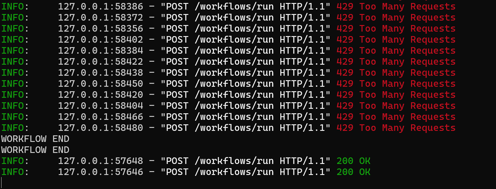

# Tutorial — Implementando Rate Limit e Controle de Concorrência em FastAPI

## Objetivo

Este tutorial demonstra como implementar rapidamente:

- Rate Limit
- Controle de concorrência
- Proteção para SSE (Server-Sent Events)

em aplicações FastAPI utilizadas como agentes de IA, workflows, LangGraph, LangChain ou integrações com LLM.

O objetivo principal é proteger a aplicação contra:

- excesso de requests
- loops de agentes
- explosão de sessões SSE
- sobrecarga do pod Kubernetes
- saturação de CPU/memória
- excesso de chamadas ao provedor LLM
- concorrência excessiva

---

# Código Completo

```python
from fastapi import FastAPI, Request
from fastapi.responses import StreamingResponse
from slowapi import Limiter
from slowapi.util import get_remote_address
from slowapi.errors import RateLimitExceeded
from slowapi.middleware import SlowAPIMiddleware
from slowapi.extension import _rate_limit_exceeded_handler

import asyncio
import uvicorn

def rate_limit_key(request: Request):
    session_id = request.headers.get("X-Session-Id")

    if session_id:
        return session_id

    return get_remote_address(request)

limiter = Limiter(key_func=rate_limit_key)

app = FastAPI()

app.state.limiter = limiter

app.add_exception_handler(
    RateLimitExceeded,
    _rate_limit_exceeded_handler
)

app.add_middleware(SlowAPIMiddleware)

WORKFLOW_SEMAPHORE = asyncio.Semaphore(2)
SSE_SEMAPHORE = asyncio.Semaphore(1)

@app.post("/workflows/run")
@limiter.limit("2/minute")
async def run_workflow(request: Request):

    async with WORKFLOW_SEMAPHORE:

        print("WORKFLOW START")

        await asyncio.sleep(5)

        print("WORKFLOW END")

        return {
            "status": "SUCCESS",
            "message": "Workflow executado"
        }

async def event_generator():

    for i in range(10):
        yield f"data: evento {i}\n\n"
        await asyncio.sleep(1)

@app.get("/agent/sse")
@limiter.limit("2/minute")
async def sse(request: Request):

    async with SSE_SEMAPHORE:

        print("SSE START")

        response = StreamingResponse(
            event_generator(),
            media_type="text/event-stream"
        )

        return response

@app.get("/health")
async def health():
    return {"status": "ok"}

if __name__ == "__main__":

    uvicorn.run(
        "main:app",
        host="0.0.0.0",
        port=8000,
        reload=False,
    )
```

---

# Principais Pontos

## Rate Limit Key

Define qual será a chave usada para controle do rate limit.

Neste exemplo:
- primeiro usa X-Session-Id
- depois fallback para IP remoto

Isso evita bloquear vários usuários atrás do mesmo proxy.

---

## Limiter

```python
limiter = Limiter(key_func=rate_limit_key)
```

Cria o mecanismo de rate limit.

---

## Middleware

```python
app.add_middleware(SlowAPIMiddleware)
```

Responsável por interceptar as requests e aplicar o rate limit.

---

## Exception Handler

Retorna HTTP 429 quando o limite é excedido.

---

## Semaphore

```python
WORKFLOW_SEMAPHORE = asyncio.Semaphore(2)
```

Permite apenas:
- 2 workflows simultâneos

Protege CPU, memória e chamadas LLM.

---

## SSE Semaphore

```python
SSE_SEMAPHORE = asyncio.Semaphore(1)
```

Limita conexões SSE simultâneas.

---

## Decorator de Rate Limit

```python
@limiter.limit("2/minute")
```

Limita requests por endpoint.

---

## Request Obrigatório

O slowapi exige:

```python
request: Request
```

Sem isso o limiter não funciona corretamente.

---

# Instalação

```bash
pip install fastapi uvicorn slowapi limits
```

---

# Execução

```bash
python main.py
```

ou

```python
uvicorn main:app --port 8000
```

---

# Teste Simples

```bash
for i in {1..100}
do
  curl -i -X POST http://localhost:8000/workflows/run
done
```

---

# Teste Paralelo

```bash
seq 100 | xargs -I{} -P50 curl -i -X POST \
http://localhost:8000/workflows/run
```

---

# Resultado Esperado

Após atingir o limite:

```http
HTTP/1.1 429 Too Many Requests
```



---

# Observação Importante

Use:

```python
reload=False
```

Porque reload=True pode recriar processos e resetar os contadores do slowapi.

---

# Limitações

O slowapi não é distribuído entre pods Kubernetes.

Cada pod mantém seu próprio contador.

---

# Evolução Recomendada

## Curto Prazo

- slowapi
- semaphore

## Médio Prazo

- Redis backend
- NGINX ingress rate limit

## Longo Prazo

- OCI API Gateway
- OCI WAF

## Referências

- [SlowAPI](https://slowapi.readthedocs.io/en/latest/)

## Acknowledgments

- **Author** - Cristiano Hoshikawa (Oracle LAD A-Team Solution Engineer)
